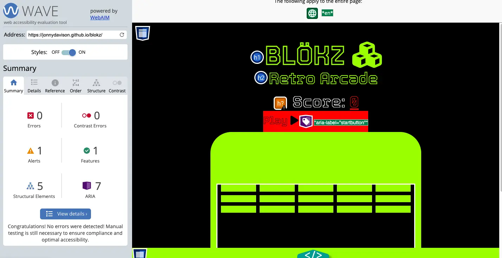
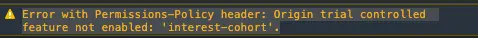

# BLÖKZ

#### [Visit Live Site](https://jonnydavison.github.io/blokz/) / [Visit Repository](https://github.com/JonnyDavison/blokz)

## [BLÖKZ](https://jonnydavison.github.io/blokz/) Retro Arcade was created to bring you back to those early days in 2D gaming.

Providing hours of fun in that familiar retro style, or introducing a new generation to classic computer games such as BLÖKZ. The retro look and design gives that nostalgic feeling of 1970s gaming!

## CONTENTS
 - [Project Overview](#project-overview)
    - [Project Goals](#project-goals)
- [User Experience](#user-experience)
    - [User Expectations](#user-expectations)
    - [User Stories](#user-stories)
- [Design](#design)
    - [Colour Scheme & Styling](#colour-scheme--styling)
    - [Typography](#typography)
    - [Imagery](#imagery)
    - [Structure](#structure)
- [Features](#features)
    - [Home Page](#home-page)
    - [Navigation](#navigation)
    - [The Footer](#the-footer)
- [Future Implementations](#future-implementations)
- [Technologies Used](#technologies-used)
    - [Languages Used](#languages-used)
    - [Programs Used](#programs-used)
- [Deployment](#deployment)
- [Testing](#testing)
    - [Manual Testing](#manual-testing)
    - [Automated Testing](#automated-testing)
        - [Lighthouse Report](#lighthouse-report)
        - [W3C Validation](#w3c-html--css-validator)
    - [Accessibility](#accessibility)
    - [Bugs](#bugs)
    - [Final Testing Results](#final-testing-results)
- [Credits](#credit)
    - [Code used and adapted](#code-used-and-adapted)
    - [Websites Used to gather information](#websites-visited-to-gather-information)

[Back to top ⇧](#blökz)

## Project Overview
The development of 'BLÖKZ' is the a throwback to the early games that gave joy to and entertained millions. These games started so many young minds interest in computers and computer scinece as they wanted to learn to build and create games of their own. This has given rise to forward thinking and ever advancing gameing and technology indusrty. The Global gaming industry has an estimated worth of over $300 Billion, and every young gamer and developer has to start some where, this is why the author has creaeted BLÖKZ.
There are built in features to assist and guide the user through the game:

- Highly recogniseable display
- User feedback (on screen game responds to user input by click or keyboard)
- Text spacing for user readability 
- Score counting for the user can see their current socre
- Game Over / Winner displayed when the game is over

## Project Goals
- Bringing Gamers together through classic gaming
- Develop a Java Script Web App
- Present the game in a clear and easy to understand manner
- Keep good UX principles regarding layout and interaction
- Robust Java Script code without issues/bugs

[Back to top ⇧](#blökz)

## User Experience
### User Expectations
- Able to quickly understand what the app is for 
- Resposne to keypress or click
- Playable on most screen sizes
- No logic errors

### User Stories
- I want to know what game is
- I want to enjoy the UX
- I want to be able to complete the game
- I want to the GUI to respond to input (Keypress or Click)
- I want no bugs or issues in the program

[Back to top ⇧](#blökz)

## Design
### Colour Scheme & Styling
In order to give the authentic look and feel of a retro game the color palette was chosen. It was also important that the color palette has a high contrast to provide good UX and readability. It is important that the color palette is a combination of colors provided not only the visual foundation of the BLÖKZ brand, but to create a user interface that is aesthetically pleasing and enjoyable to use.

[Back to top ⇧](#blökz)
### Typography
The fonts were imported from Google Fonts database.'Tourney' is used throughout the site, this matches both the stlye and readability criteria that the author had set. The back-up font incase the selected doesn't load is sans-serif.

### Imagery
Icons where imported from [Font Awesome](https://fontawesome.com/) to create recognisable links and a smooth UX. 

[Favicon.io](https://favicon.io/) used to create a Favicon for greater UX/UI.

### Structure
- BLÖKZ is structured in a user friendly and easy to navigate way.
- On laoding the user is greeted by a game that they can understand visually and instictivly know how to play
- The Logo and title confrom with expectations and user stories
- The 'Play' button allows the user to start the game when they are ready, with an icon that visually assists the user
- The 'Reset' button allows the user to re-start the game at any point, again with an icon that visually assists the user
- If the User completes or looses the game there is a 'Winner' or 'Game Over' displayed along with the reset button to allow the user to restart and play again
- The footer contains basic copyright and links to social media allowing the game to be shared and discussed with others

[Back to top ⇧](#blökz)

## Features
Bright, retro-style logo creates a memorable and easily remembered brand 

#### Home Page 
(index.html)
- Landing ready to play leaving the user only one click away from enjoying a game
- Recognisable immediately any user will be able to understand and play
    

#### Navigation
- Kept to a simple one-page site with bright red buttons and using recognisable icons, keeps the functionality and user experience easy

     

#### The Footer 
    - Social Media links encourage engagement, feedback, and a sense of community with other players. Opening on a new tab for easy user navigation
    - The © shows the ownership of the content and website

    

[Back to top ⇧](#blökz)

## Technologies Used
 ### Languages 
- [HTML5](https://en.wikipedia.org/wiki/HTML)
- [CSS3](https://en.wikipedia.org/wiki/CSS)
- [JavaScript ES6](https://en.wikipedia.org/wiki/JavaScript)

### Frameworks & Tools
1. [Google Fonts](https://fonts.google.com/)
     - Library used to import 'Tourney' used throughout
2. [Font Awesome](https://fontawesome.com/)
    - Added aesthetic and improved UX with recognizable icons
3. [Favicon.io](https://favicon.io/)    
    - Adding a favicon improving UX & UI
4. [Git Hub](https://github.com/JonnyDavison/MoreThanFed)
    - Used to store and deploy the site 
5. [Git](https://www.gitpod.io/)
    -  Version control, code editing, committing through terminal commands, git commit & git push. 
6. [Am I Responsive](https://ui.dev/amiresponsive)
    - Responisveness testing

[Back to top ⇧](#blökz)

## Deployment
This site is deployed through GitHub pages
Deployment method   
- Enter the GitHub repository
- Navigate to 'Settings'
- On the left side of the page, navigate to 'Pages'
- Scroll to 'Build and deployment.'
- Set source to 'Deploy from a branch'
- Below is 'Branch' select 'main' and 'root' 
- The page will refresh, and a banner will appear to confirm the successful deployment 
- the link will be in the banner along with 'Visit site'

N.B - it may take a few minutes to build/deploy

## Testing 
Testing throughout the development process ensured the functionality and flow gave both good UX and UI. As development moved to responsiveness, media queries lead to code refactoring, and bug fixes.  

In response to User stories.
- I want to know what game is
    - Upon loading the logo the game is displayed as ready to play
- I want to enjoy the UX
    - The bright, high contrast design is both asethically pleaseing and has good readibility
- I want to be able to complete the game
    - The game is easy to navigaite and use making the game fun but doable
- I want to the GUI to respond to input (Keypress or Click)
    - The buttons and functionality respond to the user input (Keypress or Click)
- I want no bugs or issues in the program
    - At this deployment there is no errors in the game logic or in the console. At this time, the author is unaware of any ways a 'normal' user could 'break' the program

[Back to top ⇧](#blökz)

### Manual Testing   
Manual testing was carried out throughout the development of each element in the program, running the parts individually and together. This was done through the GitPod terminal. After the project was deployed further manual testing was carried out. 

Manual testing led to bugs in User movement being ironed out stopping 'jumpy' Slider movement. Mobile testing lead to resizing the 'slider' and the 'grid' to ensure full functionality of the game. 

Manual Tests included
- Browser tests on Chrome, Firefox and Safari
    - Note that older versions of safari do not support .webp image format
- Responsiveness tests, Chrome dev tools
    - Tests resulted in additional breakpoints
-  Accessibility 
    - All components meet accessibility expectations, contrast and readability 
- External Links    
    - To further social media, open a separate tab to assist UX navigation

[Back to top ⇧](#blökz)

### Automated Testing

### Lighthouse report

### W3C html & CSS validator 
JavaScript, HTML & CSS3 are all validated by the tools below.
- [JavaScript Validation](https://jshint.com/)
- [HTML Validation](https://validator.w3.org/nu/#textarea)
- [CSS3 Validation](https://jigsaw.w3.org/css-validator/#validate_by_input)

    

        
            
Valid CSS!

### [JS Hint](https://jshint.com/)

[Back to top ⇧](#blökz)

### Accessibility
#### Wave Accessibility Test
The [Wave Accessibility Test](https://wave.webaim.org/) is powered by WebAIM and has displayed 0 errors when checking acceddibility standards 

[Back to top ⇧](#blökz)

## Future Versions 
Future versions to include
- Lives
    - A set number of lives as levels increase to allow the user a 2nd chance at winning  
- Levels
    - Different difficulty settings as you complete each round to increase difficulty. This could entail, making the ball faster, the 'slider' smaller, and a larger number of smaller blocks, alone and in combination. 

[Back to top ⇧](#blökz)

## Bugs
As the project was built there were many bugs during the development process, many of these were resolved quickly through research of the relevant documentation, Stack Overflow and W3Schools

### Known Bug
There is a known bug becasue the app is deplyed throught GitHub. GitHub hosted pages disable FLoC, which is Google's 3rd party cookie alternative creating the error in the console as below.

### Final Testing results
After extensive manual and automated testing all tests where passed. Initially There was errors displayed in W3C HTML, W3C CSS and JsHint these where corrected and the tests re-ran.

| Automated Test     |  Pass / Fail  |
| -----------------  | ------------- |
| Lighthouse Report  |      Pass     |
| W3C HTML           |      Pass     |
| W3C CSS            |      Pass     |
| JS Hint            |      Pass     |
| Wave Accessibility |      Pass     |

## Credits 
### Code 
Support and resources found at
- [Stack Overflow](https://stackoverflow.com/)
- [W3school](https://www.w3schools.com/)
- [Code Institute](https://codeinstitute.net/ie/), including ['Love Maths'](https://github.com/Code-Institute-Solutions/readme-love-maths)
- [Mdn Web Docs](https://developer.mozilla.org/en-US/)
- [Free Code Camp](https://www.freecodecamp.org/)
- [Stack Overflow](https://stackoverflow.com/)
- [W3Schools](https://www.w3schools.com/)

[Back to top ⇧](#blökz)