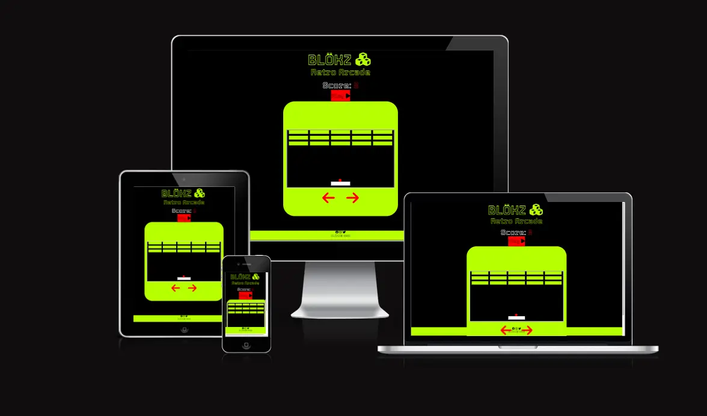
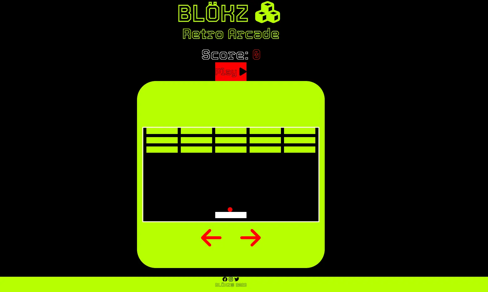
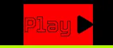
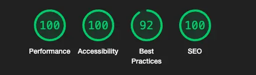

# [BLÖKZ](https://jonnydavison.github.io/blokz/)              
[Visit Repository](https://github.com/JonnyDavison/blokz)

## [BLÖKZ](https://jonnydavison.github.io/blokz/) Retro Arcade was created to bring you back to those early days in 2D gaming.

Providing hours of fun in that familiar retro style, or introducing a new generation to classic computer games such as BLÖKZ. The retro look and design gives that nostalgic feeling of 1970s gaming!

## Project goals
Bringing Gamers together through classic gaming

## Features 
Bright, retro-style logo creates a memorable and easily remembered brand 

- Home Page (index.html)
    - Landing straight ready to play leaving the user only one click away from enjoying a game
    - Recognisable immediately any user will be able to understand and play
    

- Navigation
    - Kept to a simple one-page site with bright red buttons and using recognisable icons, keeps the functionality and user experience easy
  

- The Footer 
    - Social Media links encourage engagement, feedback, and a sense of community with other players. Opening on a new tab for easy user navigation
    - The © shows the ownership of the content and website
     
        

## Technologies Used
 ### Languages 
- HTML5
- CSS3
- JavaScript ES6

### Frameworks & Tools
1. [Google Fonts](https://fonts.google.com/)
     - Library used to import 'Tourney' used throughout
2. [Font Awesome](https://fontawesome.com/)
    - Added aesthetic and improved UX with recognizable icons
4. [Git Hub](https://github.com/JonnyDavison/MoreThanFed)
    - Used to store and deploy the site 
5. [Git](https://www.gitpod.io/)
    -  Version control, code editing, committing through terminal commands, git commit & git push. 
6. [Am I Responsive](https://ui.dev/amiresponsive)
    - Responisveness testing

## Testing 
Testing throughout the development process ensured the functionality and flow gave both good UX and UI. Testing led to bugs in User movement being ironed out stopping 'jumpy' Slider movement, further increasing the UX. 

As development moved to responsiveness, media queries lead to code refactoring, and bug fixes.  

- Browser tests on Chrome, Firefox and Safari
    - Note that older versions of safari do not support .webp image format
- Responsiveness tests, Chrome dev tools
    - Tests resulted in additional breakpoints
-  Accessibility 
    - All components meet accessibility expectations, contrast and readability 
- External Links    
    - To further social media, open a separate tab to assist UX navigation

## Lighthouse report

## W3C html & CSS validator 
JavaScript, HTML & CSS3 are all validated by the tools below.
- [JavaScript Validation](https://jshint.com/)
- [HTML Validation](https://validator.w3.org/nu/#textarea)
- [CSS3 Validation](https://jigsaw.w3.org/css-validator/#validate_by_input)

    

        
            
Valid CSS!

        
## Deployment
This site is deployed through GitHub pages
Deployment method   
- Enter the GitHub repository
- Navigate to 'Settings'
- On the left side of the page, navigate to 'Pages'
- Scroll to 'Build and deployment.'
- Set source to 'Deploy from a branch'
- Below is 'Branch' select 'main' and 'root' 
- The page will refresh, and a banner will appear to confirm the successful deployment 
- the link will be in the banner along with 'Visit site'

N.B - it may take a few minutes to build/deploy

## Credits & Acknowledgements

### Code 
Support and resources found at
- [Stack Overflow](https://stackoverflow.com/)
- [W3school](https://www.w3schools.com/)
- [Code Institute](https://codeinstitute.net/ie/), including ['Love Maths'](https://github.com/Code-Institute-Solutions/readme-love-maths)
- [Mdn Web Docs](https://developer.mozilla.org/en-US/)
- [Free Code Camp](https://www.freecodecamp.org/)
- [Stack Overflow](https://stackoverflow.com/)
- [W3Schools](https://www.w3schools.com/)
